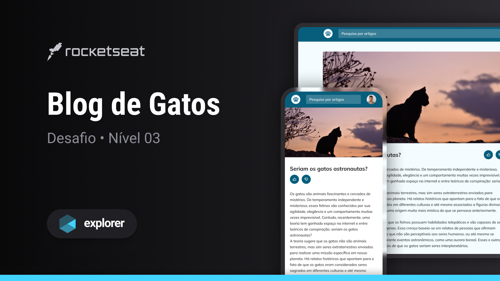

# Blog de gatos
Esse desafio consiste em desenvolver um site responsivo de blog com artigos sobre gatos. O projeto também apresenta uma barra de busca, recomendação de artigos relacionados e avaliação do artigo.  
Feito no curso Explorer da Rocketseat.

## Tecnologias usadas:
- HTML  
- CSS  
- Git

## Layout
Esse projeto foi feito a partir [desse](<https://www.figma.com/file/2SN8Y3Q0jr3kgcrBvxeNg9/Blog-de-Gatos-%E2%80%A2-Desafio-Explorer-(Community)?node-id=101%3A91&mode=dev>) layout do figma.
 
